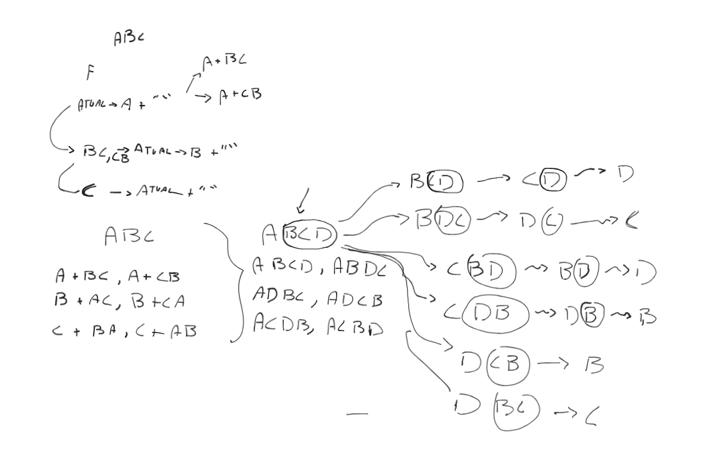

# Gerador de Anagramas em Java

Este projeto consiste em receber uma string composta por letras **distintas** e retorna **todos os anagramas possíveis** dessa string.

## ✨ Exemplo de uso

```java
List<String> anagramas = Anagram.getAnagrams("abc");
// Saídas possiveis:
// abc
// acb
// bac
// bca
// cab
// cba
```
# Como rodar o projeto
### Pré-requisitos
- Java 17 ou superior
- Maven 3.6 ou superior
- IDE de sua preferência (IntelliJ, Eclipse, etc.)

1. Clone o repositório:
2. Execute via terminal ou IDE

# Funcionalidades
- Gera todos os anagramas possíveis de uma string com letras distintas.
- Validaçoes:
    - Verifica se a string contém apenas letras.
    - Verifica se a string não está vazia.
    - Verifica se a string possui apenas letras distintas.
# Explicando o código:

O código foi desenvolvido pensado em um esboço que realizei no Excalidraw, onde eu pensei que
eu deveria sempre fixar uma letra e permutar as outras letras, assim eu conseguiria. Portanto,
eu criei uma função recursiva que vai fixando a letra e chamando a função novamente, até que
eu tenha fixado todas as letras. Basicamente foi essa a ideia. Segue a imagem de como foi pensada a 
ideia: 